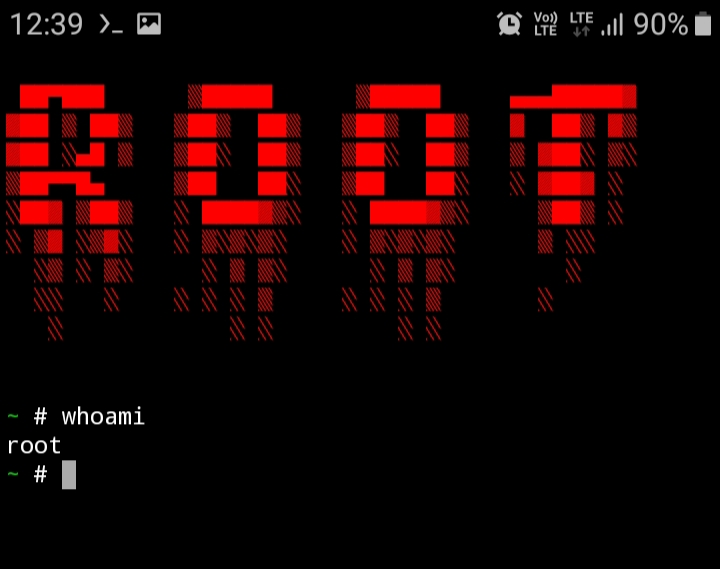
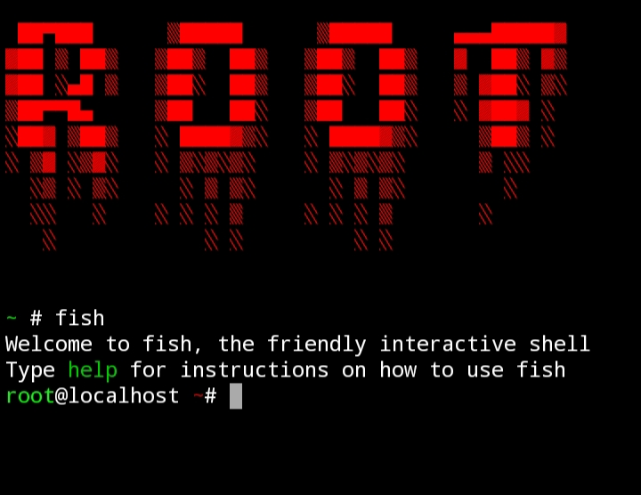

# Root
Root is an automated tool which help you to gain to access of fake root privileges and real root privileges without rooting your device. You don't need to install any other OS to gain the root privileges in your termux. This tool(ROOT) is specifically made for termux and termux users. This tool will also help you to gain the look of Kali-Linux in your termux with root access.  
<centre>

</centre>

# Fake Root Privileges
This tool helps you to access the fake root privileges in termux. To access the fake root privileges in termux, just type <pre>fakeroot</pre> in termux. And here you go, Now you have gain the fake root privileges access in termux.

# Real Root Privileges
This tool also helps to access the real root privileges in termux. Which is more powerful and stronger than fake root privileges. To access the real root privileges just type <pre>root</pre> in your termux. And here you go, You have access the real root privileges in termux without rooting your device just with This tool(Root)

# Installation
<pre>apt-get update && apt-get upgrade-y</pre>
<pre>apt-get install git -y</pre>
<pre>git clone https://github.com/adarshaddee/root.git</pre>
<pre>cd root</pre>

<pre>chmod +x main</pre>

<pre>./main</pre>

# Add-ons
You can use <pre>fish</pre> command to make your termux more attractive.  
<centre>

</centre>

# One line Installation
<pre>apt-get update && apt upgrade-y && apt-get install git -y && git clone https://github.com/adarshaddee/root.git</pre>

# Copyright
<pre>© Copyright credits goes to Adarsh Addee. This tool is public tool anyone can use this tool.</pre>
